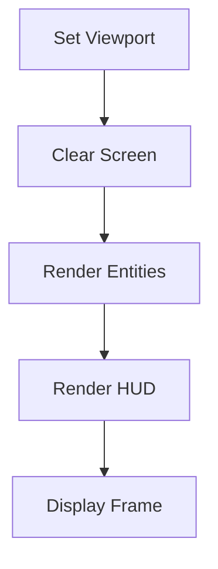

# Client Rendering System

The **Rendering System** in the client is responsible for displaying the game world, entities, and UI elements efficiently. It leverages **SFML** to handle real-time rendering and ensures smooth graphical updates.

## Overview

Rendering in the client is handled through an **SFML-based render loop** inside `GameClient`. The system updates the viewport, clears the screen, draws all game entities, and finally renders the HUD before displaying the frame.

### Key Features
- **Efficient Entity Rendering**: Uses SFML to draw game objects efficiently.
- **Viewport Management**: Ensures proper zooming and movement tracking.
- **HUD Rendering**: Draws UI elements on a separate layer.
- **FPS Capping**: Uses vertical sync and frame rate limits to optimize performance.

---

## Rendering Pipeline

The rendering process follows these steps:

1. **Set Viewport**: Adjusts the view according to the player's position.
2. **Clear Screen**: Clears the previous frame.
3. **Render Game Entities**: Draws all in-game elements such as **cells, pellets, and the world boundary**.
4. **Render HUD**: Draws the leaderboard, player stats, and UI elements.
5. **Display Frame**: Pushes the final frame to the screen.

---

## Viewport System
The viewport ensures smooth camera transitions and zooming, providing a dynamic perspective of the game world.
- **Tracking**: The viewport follows the player's position with interpolation.
- **Zooming**: Uses mouse wheel input to zoom in/out smoothly.
- **Boundary Constraints**: Prevents excessive movement outside the game world.

### Implementation
- `Viewport::applyInterpolation()` ensures smooth camera movement.
- `Zoom::setZoom()` dynamically adjusts the zoom level based on user input.

---

## Entity Rendering
Game entities are drawn based on their type and properties.

### World
- **The game world** is drawn as a large rectangle representing the boundaries.
- Uses `EntityManager::createWorld()` to initialize the world rendering.

### Cells (Players & Pellets)
- Cells are drawn as circles using SFML's shape system.
- `EntityManager::createCell()` and `updateCell()` handle their creation and rendering updates.

### Leaderboard & HUD
- HUD elements are rendered on top of the game view.
- Uses **SFML text and shapes** to display leaderboard, player stats, and game information.
- `HUD::update()` ensures live updates of scores, mass, and leaderboard rankings.

---

## Performance Optimizations
Several optimizations are implemented to ensure smooth rendering:
- **Batch Rendering**: Groups draw calls where possible to minimize overhead.
- **Frame Rate Limiting**: Uses `setFramerateLimit(144)` to cap FPS.
- **Culling**: Only visible objects are drawn to avoid unnecessary computations.
- **Double Buffering**: Uses `window.display()` to ensure smooth frame transitions.

---

## Conclusion
The **Rendering System** provides an optimized, efficient way to display game entities and UI elements, ensuring smooth gameplay and clear visual feedback for the player.
